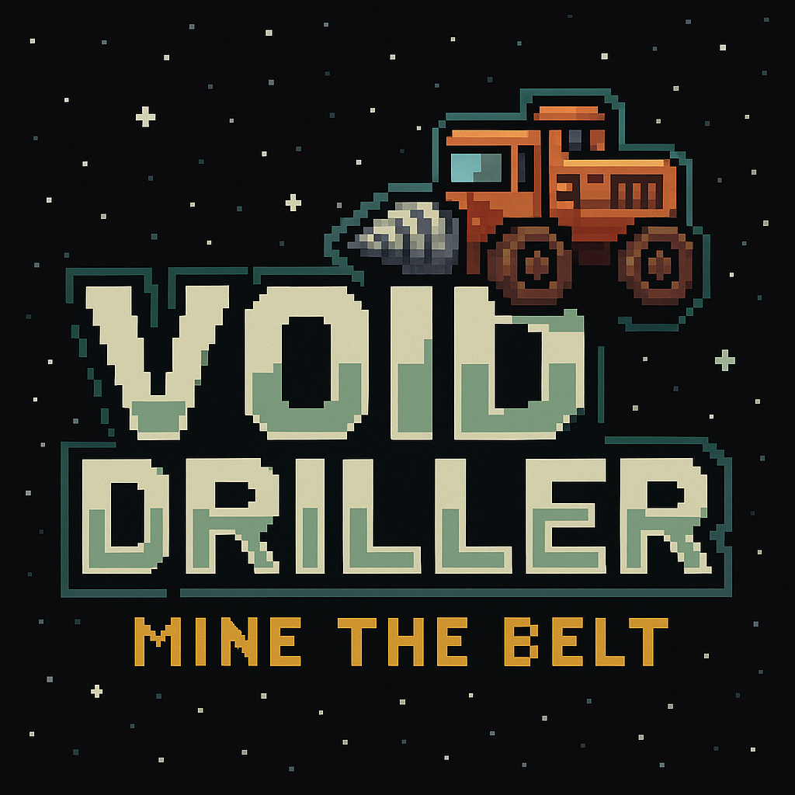

# Void Driller

> **Void Driller: Mine the Belt** is a retro-style sci-fi mining game set on the edge of known space. You pilot a modular drilling rig, carving through procedurally generated asteroids to extract rare minerals, survive unpredictable hazards, and keep **SpaceCo** happy.
>
> You begin with a modest drill rig and a single goal: **carve out a fortune among the rocks and retire before the void eats you alive**. Every mineral you sell earns **Pension Credits**, pushing you closer to a retirement pod you can actually live in.
>
> Upgrade your rig with stronger drills, more efficient engines, and specialized support modules. Sell your haul, unlock new asteroid zones, and stay one step ahead of fuel shortages, environmental hazards, and things that really shouldn’t be alive down there.
>
> Trade with other players, grow SpaceCo’s **Galactic Market Share**, and unlock SpaceCo-certified achievements as you dig deeper into the Deep Belt’s strangest secrets - one drill cycle at a time.

> Full instructions and lore: [In-Game Help](./docs/help.md)

## Setup

> Prerequisite: [Bun](https://bun.sh/docs/installation) must be installed

Clone the repo and install dependencies:

1. `git clone git@github.com:fatlard1993/void-driller.git`
2. `cd void-driller && bun install`

## Play

> Start the local game server (defaults to port `1040`)

`bun start`

Then open your browser to [http://localhost:1040](http://localhost:1040)

## Dev

> Start the local development server with hot-reloading

`bun dev`

## License

This project uses a dual license:

- 🧠 **Code** is licensed under [GNU GPL v3](https://www.gnu.org/licenses/gpl-3.0.en.html) You may modify and distribute the source code under the same license.

- 🎨 **Assets** (art, audio, etc.) are licensed under [CC BY-NC 4.0](https://creativecommons.org/licenses/by-nc/4.0/) You may remix or share assets non-commercially with credit.

See [`LICENSE`](./LICENSE) and [`CREDITS.md`](./CREDITS.md) for full details.
